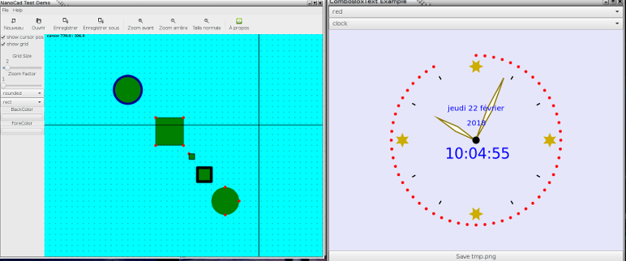

    
# GtkLuxorNaiveDemo
### [Julia](https://julialang.org/) demo for the excellent  [Luxor](https://github.com/JuliaGraphics/Luxor.jl) draw in a [Gtk](https://github.com/JuliaGraphics/Gtk.jl) canvas

#### directory simple demo
Adapt some stolen Luxor demos (except for clock)   
- Text (_with change color of circle_)  
- Stars  
- Eggs      
- clock (_dynamic runnning demo_)
- colornames
- spiral

#### directory nanocad
unfinished attempt for naive cad demo - first start (far to be finished)

#### general considerations
ugly ack because Luxor is not really adapted to do that but seem to work

native compilation possible with ancien [static-julia](https://github.com/JuliaComputing/static-julia) version copie. call to *./compile* should work on *linux*    
run executable *buildGtkLuxorDemo/gtkLuxorDemo*
